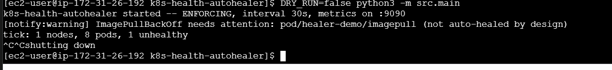
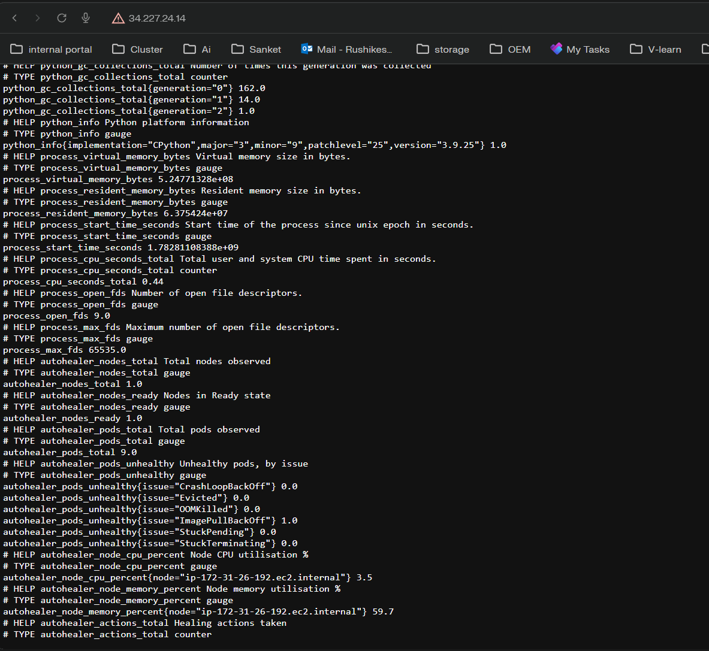

# k8s-health-autohealer

Kubernetes cluster health checker and auto-healing tool built for my capstone project.

The idea is simple - instead of manually checking pods and nodes every time something breaks, this tool does it automatically and fixes common issues on its own.

---

## What it does

- Monitors all nodes and pods in the cluster every 30 seconds
- Detects issues like CrashLoopBackOff, OOMKilled, Evicted pods, NotReady nodes
- Auto-restarts or deletes broken pods so the controller can recreate them
- Sends alerts to Slack when something needs attention
- Exposes metrics to Prometheus so you can see whats happening in Grafana
- Keeps an audit log of every action it takes

## Why I built this

Managing kubernetes manually is painful especially when you have lots of pods crashing at 3am. This tool handles the common stuff automatically and alerts you only when it actually needs a human.

---

## Project structure

```
src/           - main application code
  main.py      - the main loop
  health.py    - checks if nodes/pods are healthy
  healer.py    - fixes the issues it finds
  kube_client.py - talks to kubernetes API
  config.py    - loads config
  metrics.py   - prometheus metrics
  notifier.py  - slack alerts
  auditlog.py  - logs every action to a file

tests/         - unit tests (15 tests)
scripts/       - helper scripts
  healthcheck.py       - quick snapshot of cluster health
  simulate_failures.py - creates failing pods to test the healer

deploy/        - kubernetes manifests
  rbac.yaml          - permissions
  deployment.yaml    - deploy to cluster
  prometheus.yaml    - prometheus config
  alert-rules.yaml   - alerting rules
  alertmanager.yaml  - alertmanager config
  grafana-dashboard.json - grafana dashboard

config/config.yaml  - all settings
docker-compose.yaml - run everything locally with docker
```

---

## How to run it

### Requirements
- Python 3.10+
- A kubernetes cluster (kind or minikube works fine for testing)
- kubectl configured

### Local run (easiest way to test)

```bash
pip install -r requirements.txt
python -m src.main
```

By default it runs in **dry-run mode** which means it only logs what it would do, doesnt actually change anything. Good for testing.

### Run with docker compose (includes prometheus + grafana)

```bash
docker compose up --build
```

- Healer: http://localhost:9090/metrics
- Prometheus: http://localhost:9091
- Grafana: http://localhost:3000

### Deploy to kubernetes

```bash
kubectl apply -f deploy/rbac.yaml
kubectl apply -f deploy/deployment.yaml
```

### AWS EC2 setup (what I used for the demo)

I ran this on a t3.small EC2 instance with k3s. There's a setup script in `deploy/ec2-k3s-setup.sh` that automates the whole thing.

```bash
# on the EC2 instance
curl -sfL https://get.k3s.io | sh -
git clone https://github.com/Rushiargade/k8s-health-autohealer.git
cd k8s-health-autohealer
pip3 install -r requirements.txt
kubectl apply -f deploy/rbac.yaml
python3 -m src.main
```

---

## Configuration

Edit `config/config.yaml` to change settings:

```yaml
interval_seconds: 30   # how often to check
dry_run: true          # set false to actually fix things

thresholds:
  node_cpu_percent: 85
  pod_restart_threshold: 5   # restarts before it tries to fix the pod

healing:
  delete_evicted_pods: true
  restart_crashloop_pods: true
  cordon_unready_nodes: false  # kept this off by default, risky

slack:
  webhook_url: ""   # or set SLACK_WEBHOOK_URL env variable
```

---

## Self healing actions

| Problem | What it does |
|---|---|
| Pod is Evicted | Deletes it (controller makes a new one) |
| CrashLoopBackOff (5+ restarts) | Deletes pod so it restarts fresh |
| OOMKilled | Same as above |
| Stuck Terminating | Force deletes it |
| Node NotReady | Cordons the node (optional, off by default) |
| High CPU | Scales up the deployment |
| ImagePullBackOff | Just alerts, cant fix a bad image name |
| Stuck Pending | Just alerts, usually a scheduling problem |

---

## Live demo screenshots (AWS EC2)

### Simulate failures



Created crashloop and imagepull pods to test detection.

### Healer detecting and fixing


Switched from dry-run to enforcing. Healer detected CrashLoopBackOff at restart 5 and deleted the pod. Controller made a fresh one.

### Prometheus metrics in browser



Real metrics from the live AWS cluster:
- 1 node ready
- 9 pods total
- ImagePullBackOff: 1 (alert only)
- CPU: 3.5%, Memory: 59.7%

### Audit log entry (actual output)

```json
{"ts": "2026-06-30T09:18:35.321198+00:00", "action": "restart_pod", "target": "pod/healer-demo/crashloop", "result": "applied", "dry_run": false, "issue": "CrashLoopBackOff", "restarts": 5}
```

---

## Tests

```bash
python -m unittest discover -s tests -v
```

15 tests covering pod classification, node classification, and kubernetes quantity parsing. Runs without a cluster.

```
Ran 15 tests in 0.003s
OK
```

---

## Metrics exposed

| Metric | What it tracks |
|---|---|
| autohealer_nodes_total | total nodes |
| autohealer_nodes_ready | nodes in ready state |
| autohealer_pods_total | total pods |
| autohealer_pods_unhealthy | unhealthy pods by type |
| autohealer_node_cpu_percent | cpu per node |
| autohealer_actions_total | healing actions taken |

---

## Sprint summary

| Sprint | What I built |
|---|---|
| 1 | Project setup, kubernetes API access, prometheus config |
| 2 | Node and pod health checks, metrics, alert rules |
| 3 | Pod self healing, audit log |
| 4 | Node cordon, CPU based scaling |
| 5 | Slack alerts, alertmanager integration |
| 6 | Grafana dashboard, testing, docs |

---

## Known limitations / TODO

- No horizontal pod autoscaler integration yet, scaling is basic
- Grafana dashboard only has 4 panels, could add more
- No multi cluster support
- Metrics server needed for CPU/memory stats (works without it but no resource data)

---

## Cost

Ran on t3.small (~$0.02/hr). The healer itself uses under 200m CPU and 128Mi memory. Scale-in logic reduces replica count when cluster is idle which saves on pod resource costs.

---

## License

MIT
